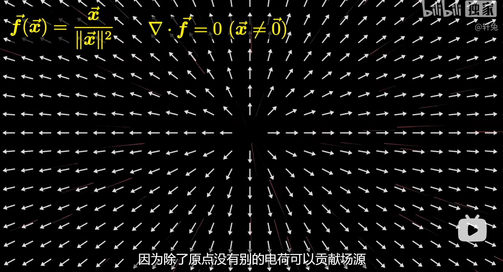
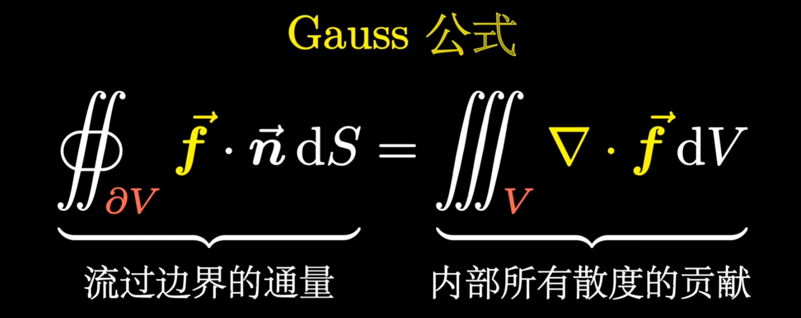
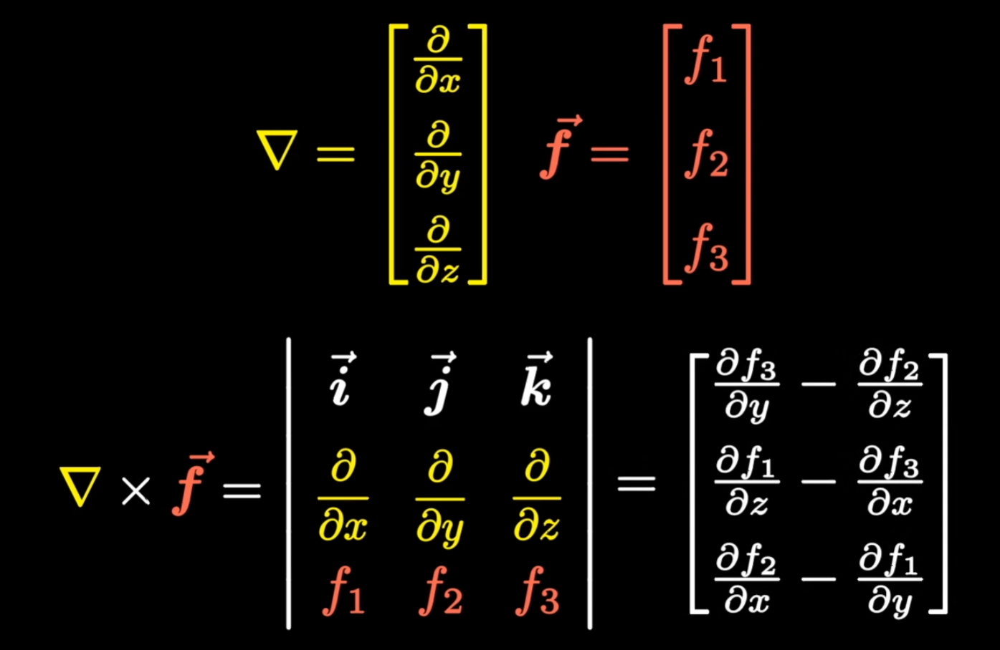
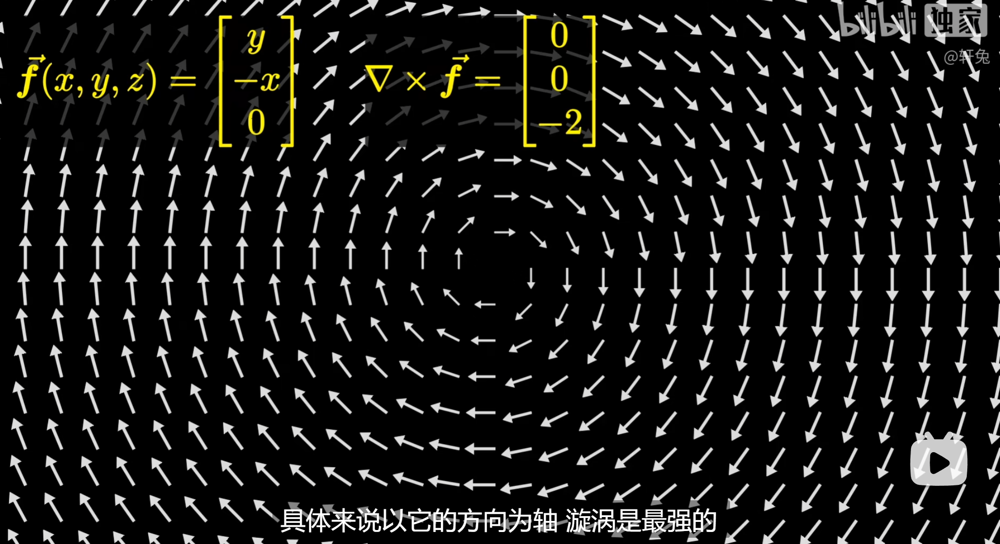
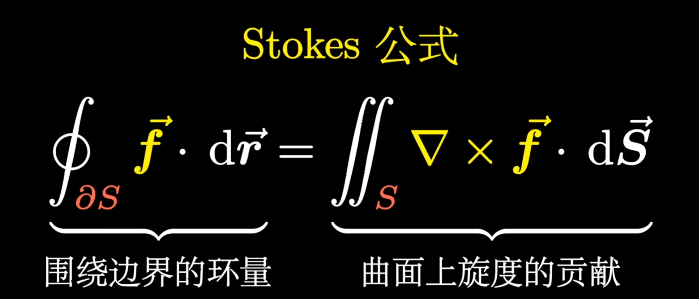

# Nabla算子

[参考](https://www.bilibili.com/video/BV1a541127cX/?spm_id_from=333.337.search-card.all.click&vd_source=a72e0e57d1aa2c57c64020832e1cde7e)

$\nabla$：Nabla算子，将数量场变成向量场

- 当其作用于函数，如$\nabla F(r)$，意思为求该函数梯度

- 当其点乘函数，如$\nabla \cdot F(r)$，意思为求该函数的散度

- 当其叉乘（三维）函数，如$\nabla \times F(r)$，意思为求该函数的旋度

### 函数可视化

对于函数$f(x,y)=x^2+y^2$，我们有两种可视化方法，第一种叫做图像：
$$
\{(\vec{x}, f(\vec{x}))|\vec{x} \in D\}
$$

第二种叫做等值面:
$$
\{\vec{x}|f(\vec{x})=c\}
$$

等值面只需要二维空间就能表示三维数据

### 梯度

Nabla算子其实是一个向量：
$$
\nabla =\left[

\frac{\partial }{\partial x_1}, \frac{\partial }{\partial x_2 },\cdots,\frac{\partial }{\partial x_n }

\right]^{T}
$$
Nabla算子作用于函数（标量场），可以将标量场转化为向量场，我们称该向量场为**梯度**
$$
\nabla f=
\left[ 
\begin{array}{c}
	\frac{\partial f}{\partial x_1}\\
	\frac{\partial f}{\partial x_2}\\
	\vdots\\
	\frac{\partial f}{\partial x_n}\\
\end{array}
\right]
$$

梯度垂直于等值面，意义为变化最快的方向（图中黄色箭头）

### 散度

我们知道向量和向量间可以进行点乘，其结果为一个标量，那么Nabla算子和向量相乘，我们称所得到的标量为**散度**
$$
\vec{f}=\left[ 
\begin{array}{c}
	f_1\\
	f_2\\
	\vdots\\
	f_n\\
\end{array}
\right]
$$

$$
\nabla \cdot \vec{f}=\frac{\partial f_1}{\partial x_1}+\frac{\partial f_2}{\partial x_2}+\cdots +\frac{\partial f_n}{\partial x_n}
$$

上图的白色箭头表示一个向量，我们发现这些箭头都是在朝外扩散，而散度就是用来衡量箭头向外扩散的程度

散度的物理意义是通量的局部描述。我们在图上画一个圈，我们发现会有向量进入这个圈，也有向量离开这个圈，那么进出之合，我们就称之为通量（比如磁通量），我们将通量除以圈的面积，就得到了通量的体密度。若这个圆取无穷小，那么体密度的极限值就是该点的散度

是不是突然很好理解麦克斯韦方程中$\nabla \cdot \mathbf{E}=0$的原因了？

其实这个公式就是高斯公式

### 旋度

向量不仅可以点乘，其实也可以叉乘，两个三维向量叉乘，能得到一个3x3的行列式。最后得到一个矩阵，我们称为**旋度**

旋度的物理意义就是环量的面密度。现在有一个在旋转的场，我们在场上画一个圈，场在这个圈内会做功，这个功就是环量，我们求出单位面积上环量，这个极限值描述了漩涡的强度。旋度就是旋转最快的方向

### 梯度的散度

nabla算子和自己做内积，于是会得到一个数量场，意义为求梯度的散度

这个操作为$\nabla\cdot \nabla$，也可以写作$\nabla^2、\nabla^T \nabla$，但为了避免歧义，我们引入了一个新的符号，拉普拉斯算子
$$
\Delta=\nabla \cdot\nabla
$$

