# 四：几何光学

几何光学，也被称为射线光学（Ray optics），忽略光的波动性，以几何方法来研究光在均匀介质中的传播

## 基本定律

- 光沿直线传播
- 光独立传播（两条光线相遇后，传播方向不变）
- 入射角等于反射角
- 光传播是可逆的

- 折射角与入射角有关，与介质折射率有关（折射定律，也被叫做Snell定律）

$$
n_i\sin \theta_i= n_t \sin \theta_t
$$

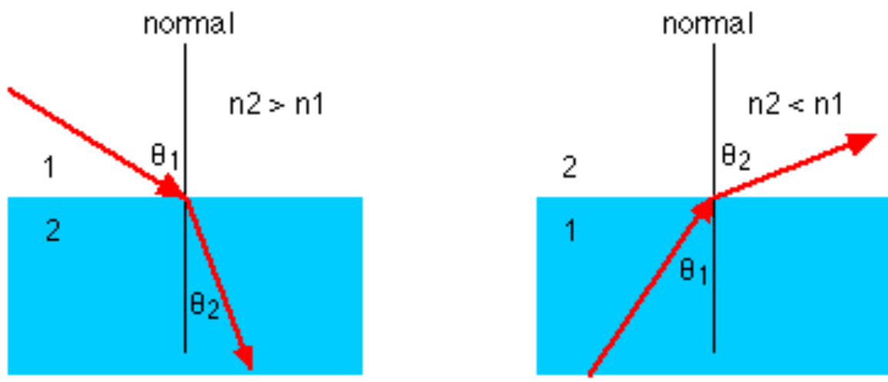

- 反射光线是最短路径（亚历山大）

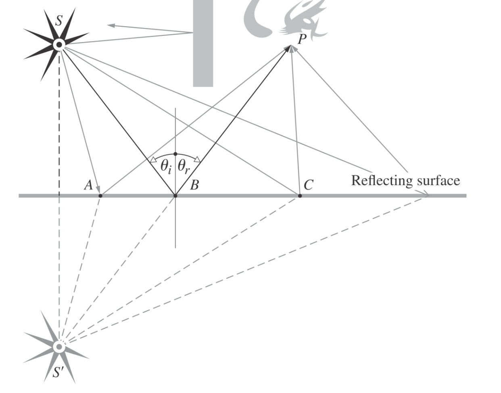

### 光程

光程长度（Optical path length，OPL）：光在介质中传播长度与介质的折射率的乘积
$$
[l]=ns
$$
费马定律（也叫最短时间原则）：

- 光在两点间的传播路径是最短路径（最短路径可以由多条，但是其光程相同）
- 两点间的光程恒定（光程函数的导数为0）

#### 例题：半球面反射光程

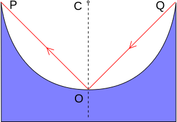

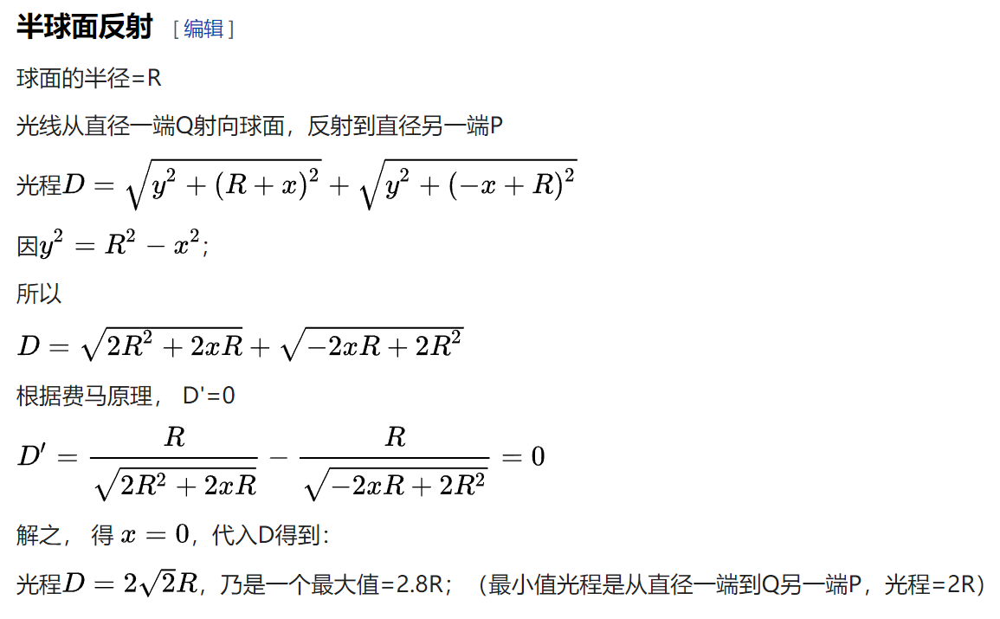

## 成像

光学系统（Optical system）：一个包含一个或多个光学元器件的系统

物体空间（Object space）：入射光线所在的区域

图像空间（Image space）：出射光线所在的区域

理想光学系统（ideal optical system）：物体能被完美地成像，比如平面镜反射

共轭点（conjugate points）：物体点和图像点组成共轭点

对于一个理想光线系统，每对共轭点的光程（后面以OPL指代）均相同

实像：物体发出的光经过反射、折射后，汇聚成新的像，被称为实像（比如凸透镜）

虚像：物体发出的光经过反射、折射后，变成了发散光线，将其反向延长得到的像，被称为虚像（比如凹透镜、平面镜）

### 人眼为什么能看到虚像

人为什么能看到东西？是因为物体经过眼睛，在视网膜上成了像，在这里，眼睛是成像系统

我们在讨论实像虚像时，提到的光学系统那些透镜们，于是虚像的全称应该是“某物体在xxx光学系统的虚像”，人眼并不是看到了“某物体在xxx光学系统的虚像”，而是在该处，经由人眼，看到了一个实像

### 理想光学系统

- 共轭性：物像种每个点、线、面都能在图像上找到对应的点、线、面
- 等光程

### 消球差平面

消球差平面（Aplanatic Surface）：允许所有光线在两点之间以相等的OPL传播的表面

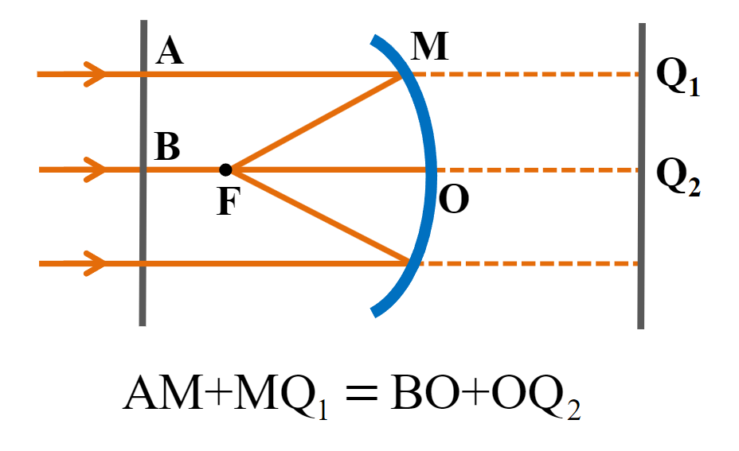

## 球面成像

### 近轴条件

近轴条件（paraxial condition）：入射角与光轴（optical axis）的夹角（用$u$表示）小于等于$5^{\circ}$

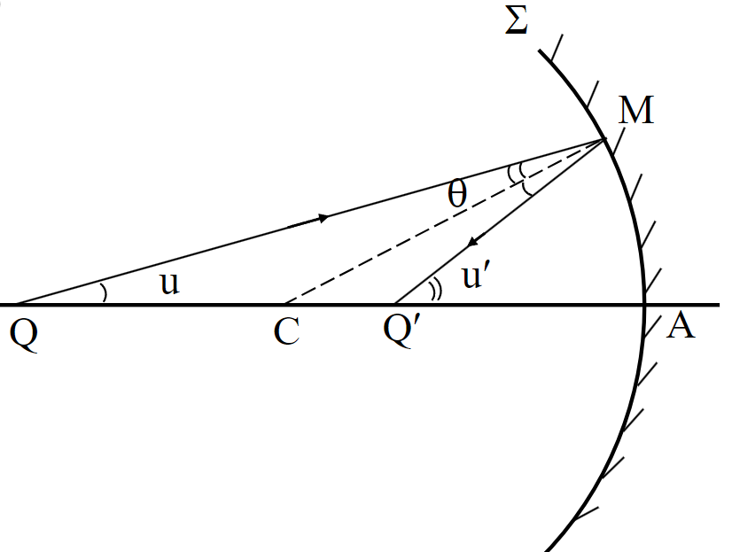

此时，三角函数可以近似
$$
\cos u \approx 1 \\
\sin u \approx u \\
\tan u \approx \sin u
$$

### 绘图标准

- 基准点：球面顶点(单球面系统)、焦点
- 基准线：光轴、各折射点的法线
- 长度量：由指定原点量起**顺光线传播方向为正**，反之为负。
- 高度量：垂直向上为正，反之为负。
- 角度量规定：以锐角衡量，以主光轴**顺时针转到光线为正**。
- 规定：图上只标绝对值。

### 球面反射

Reflection at spherical surfaces

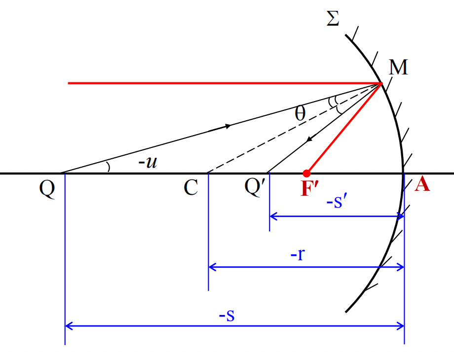

$$
\frac{1}{-s}+\frac{1}{-s'}=-\frac{2}{r}
$$

- 光轴（QA这条线）
- 焦点（image focus，图中$\mathrm{F'}$）：平行于光轴的光线打到球面上，会汇集到一点，这个个点被称为焦点
- 物体焦距（Object focal length，用$f$表示）
- 图像焦距（Image focal length，用$f'$表示）

在球面反射，物体焦距和图像焦距是相等的
$$
f= \lim_{s' \rightarrow \infty}s	
\\
f'= \lim_{s \rightarrow \infty}s'	
\\
\frac{1}{s}+\frac{1}{s'}=\frac{1}{f}
$$

### 球面折射

Refraction at spherical surfaces

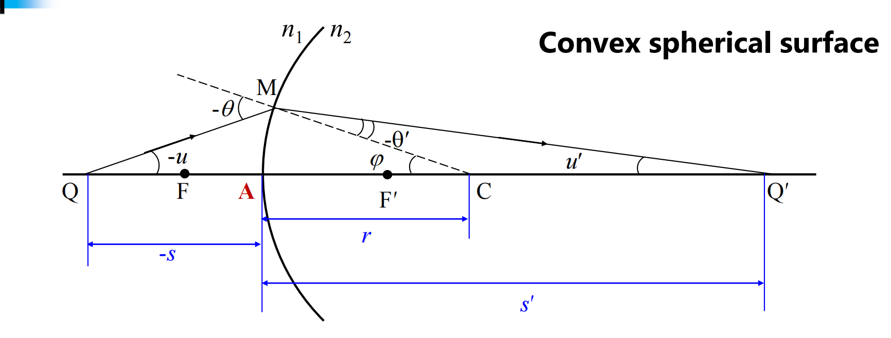
$$
\frac{n_1}{-s}+\frac{n_2}{s'}=\frac{n_2-n_1}{r} \equiv \Phi
$$

- 光焦度（用$\Phi$表示）：用与描述光线系统对光线的曲折能力

高斯透镜公式（Gaussian Lens Formula）
$$
\frac{f}{s}+\frac{f'}{s'}=1
$$
牛顿透镜公式（Newton form of Lens Formula）
$$
x_0x_i=ff'
$$
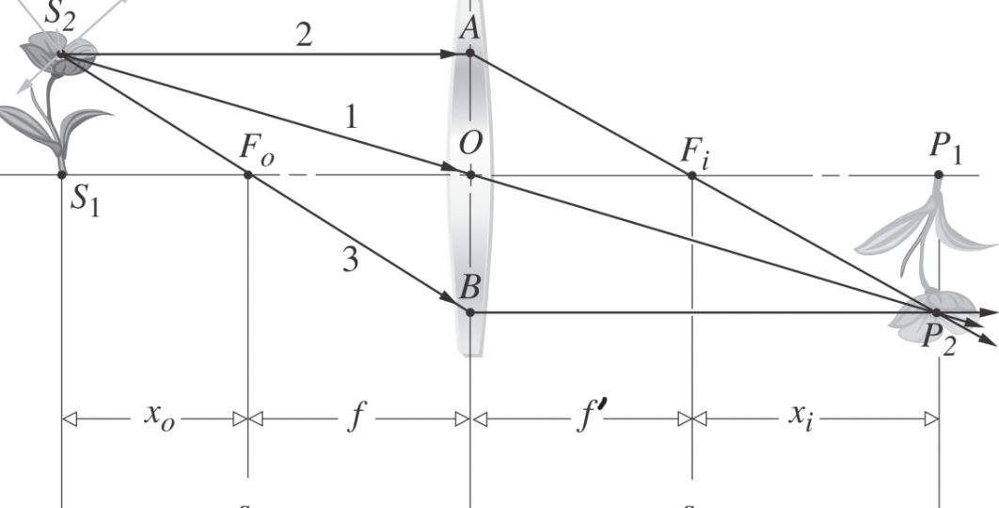

### 离轴点成像

Imaging for off-axis points

就是y比较大，导致不能使用三角函数近似

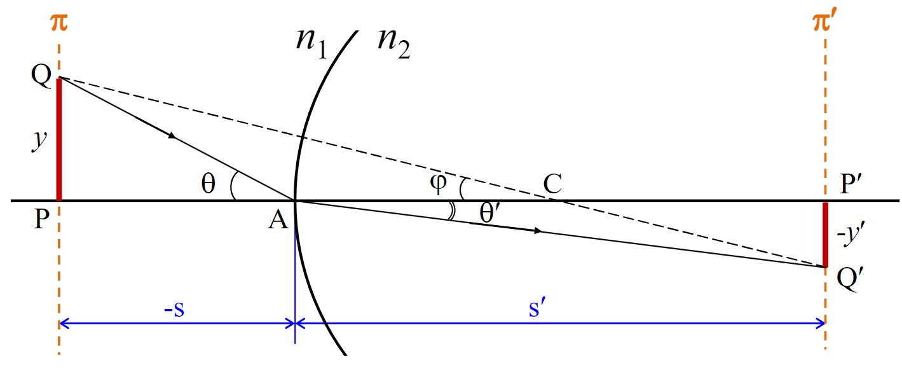

## 薄透镜成像

透镜：由两个同轴折射球组成的镜子，根据球心位置，分为凸透镜（convex lens）和凹透镜（concave lens）

薄透镜（Thin lens）：中心半径和曲率厚度可以忽略不记的透镜

光轴（Optic axis）：连接两个曲面中心的轴

光学中心（Optic center）：两个球面的基准点（vertex）视为重合，重合点就是光学中心

### 透镜公式

$$
\frac{n_1}{-s_1}+\frac{n_2}{s_2'}=\frac{n_0-n_1}{r_1}+\frac{n_2-n_0}{r_2}\equiv \Phi
$$

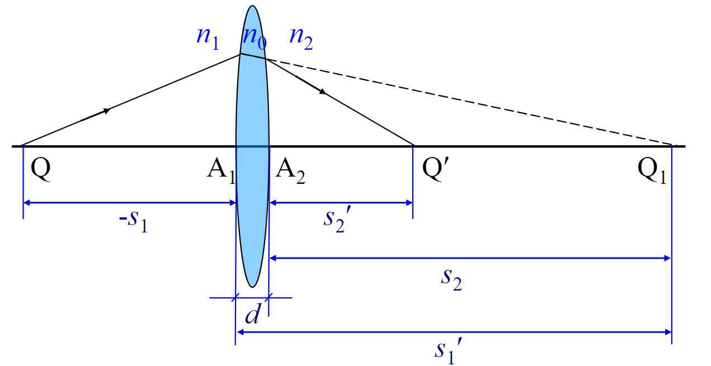

### 焦平面

焦平面（Focal plane）：垂直于光轴且经过焦点的平面

前焦平面（front focal plane）：光射入透镜的面

后焦平面（back focal plane）：光从透镜射出的面

透镜使得光的落点与入射角有关，且满足
$$
y=f \cdot \tan\theta \approx f\cdot \theta
$$
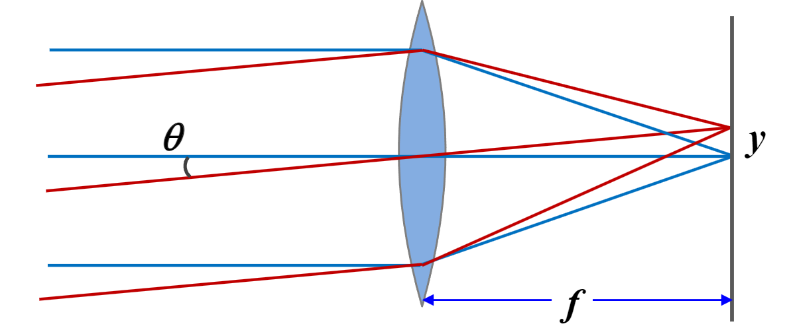

*用透镜成像等于两倍的傅里叶变换*

### 光阑

光阑（stop）：限制（limit）成像光束的器件，比如透镜（lens）、光圈（aperture）、窗口片（the frame of windows）

#### 光圈

光圈（aperture stop，下图DD’）：用于限制光线宽度的期间

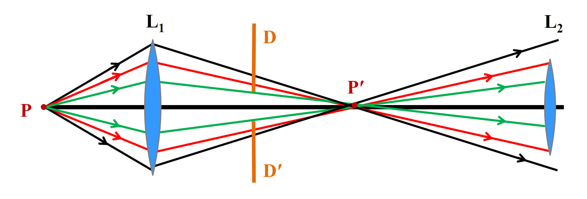

Field stop：用于限制成像区域和方位

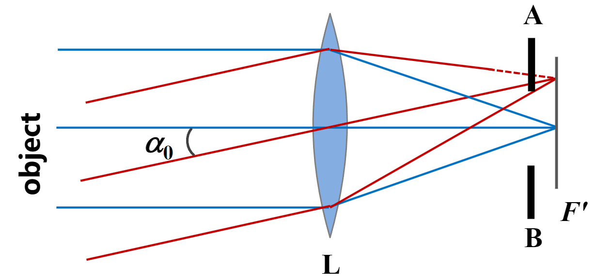

#### 景深

景深（Depth of field/focus）：聚焦深度，入射点P在光轴方向移动，移动距离$\Delta x$在景深范围内，图像是清晰的

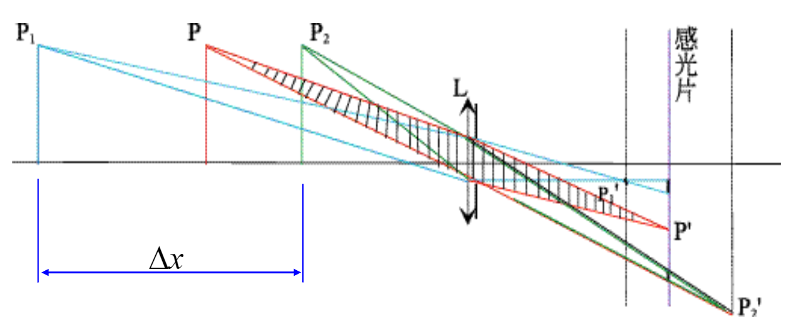

能看出图中$P_1$过早聚焦，$P_2$过晚聚焦，他们相对于$P$，都显得比较模糊

在物体空间的最大$\Delta x$被称为Depth of field

在图像空间的最大$\Delta x$被称为Depth of focus

#### 相对孔径

相对孔径（Relative aperture）：光圈的直径（用$D$表示）和焦距（focal length，用$f$表示）的比值

$D/f$越大，说明光学系统收集光的能力越强

#### f-number

相对孔径的倒数，意义为焦距是直径的多少倍

比如一个光学系统，焦距160nm，光圈直径20nm，那么它的f-number等于160/20=8，记作$f/8$

