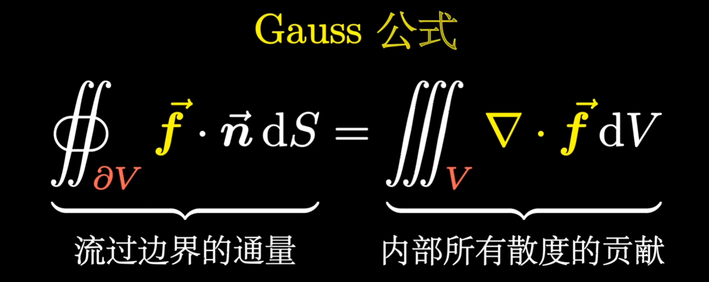

# 几何光学

- 光沿直线传播
- 光子之间独立传播
- 入射角等于反射角
- Snell定律

$$
\sin \theta_1 / \sin \theta_2=n_2/n_1
$$

角度逆时针为负，顺时针为正

## 费马光层

光层（optical path length，OPL ）：将光在**介质中传播距离**转化为等效的光**在真空中走的距离**

## 成像

- 实像（凸透镜）
- 虚像（凹透镜）

### 理想光学系统

Object Space$\rightarrow$Image Space

Object Space上的点S会在Image Space上形成一个对应的点P，我们成PS为共轭点（**共轭性**）

光学系统：一个包含一个或多个光学元件的系统

**理想光学系统**：若OS上的一个点在IS上可以完美成像，那么这个光学系统就是理想光学系统（比如理想镜面）

如果不是理想光学系统，OS上的点会在IS形成一个光斑（Blur spot）

- 共轭性：理想光学系统中，OS上的点/线/面在IS上仍为点/线/面

- OPL相同

反射系统，PM=MP‘，OPL相同，是理想光学系统，平面是等光层面

折射系统，MS>MS'，OPL不同，不是理想光学系统

- 实像的OPL为正，虚像的OPL为负，理想光学系统实像OPL和虚像OPL之和为0

### 球面成像

#### 反射

当$u\le5^{\circ}$时，光线称为近轴光线

此时
$$
\cos i=1
$$

$$
\sin i=\tan i=i
$$

$$
\frac{1}{-s}+\frac{1}{-s'}=-\frac{2}{r}
$$

- $-s$：物距
- $-s'$：像距

若光线平行入射（红线），那么其打在x轴的点称为**焦点**（F‘），此时$-s'_{F'}=-\frac{r}{2}$（这也是r和焦距f的定义）

**成像公式**
$$
\frac{1}{s}+\frac{1}{s'}=\frac{1}{f}
$$

#### 折射

$$
\frac{n_1}{-s}+\frac{n_2}{s'}=\frac{n_2-n_1}{r}=\Phi
$$

- $\Phi$：光焦度

#### 高斯成像公式

$$
\frac{f}{s}+\frac{f'}{s'}=1
$$

其中

#### 牛顿成像公式

$$
x_0x_i=ff'
$$
