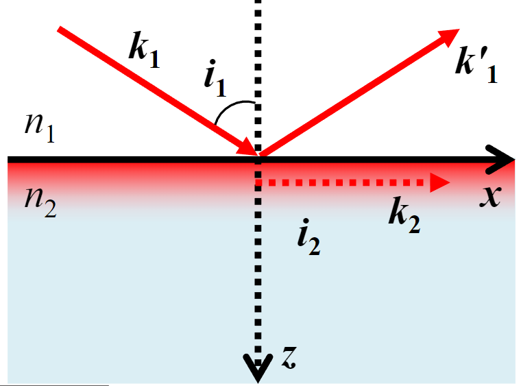

# 五：反射与折射

## 内容概述

- 光在单层各项同性表面的反射与折射
- 菲涅尔方程
- 全内反射
- 相位突变，布鲁斯特角

## 菲涅尔方程

### 菲涅尔方程

各项同性介质（Isotropic medium）：折射率处处相同的材质

光密介质：折射率高的介质（这是一个相对概念）

光疏介质：折射率低的介质（这是一个相对概念）

在几何光学中的那些反射方程，只能得到入射光、反射光、折射光间的方向关系

而菲涅尔方程（Fresnel Equations）可以求出反射光、折射光的振幅、相位、偏振

菲涅尔方程的边界条件表明：磁场和电场在边界处连续，也就是入射光的电场磁场=反射光+折射光的电场磁场

我们将入射光的电场分为两个部分，方向满足右手正交系

- 平行（parallel）于平面的电场$E_p$
- 垂直（senkrecht）与平面**向外**的电场$E_s$

经过复杂的推导，我们能得到
$$
r_p=\frac{E_{1p}’}{E_{1p}}=\frac{\tan(\mathrm{i_1}-\mathrm{i_2})}{\tan(\mathrm{i_1}+\mathrm{i_2})}	\\
r_s=\frac{E_{1s}’}{E_{1s}}=-\frac{\sin(\mathrm{i_1}-\mathrm{i_2})}{\sin(\mathrm{i_1}+\mathrm{i_2})}	\\
t_p=\frac{E_{2p}}{E_{1p}}=\frac{2\cos \mathrm{i_1}\sin \mathrm{i_2}}{\sin(\mathrm{i_1}+\mathrm{i_2}) \cos (\mathrm{i_1}-\mathrm{i_2})}	\\
t_s=\frac{E_{2s}}{E_{1s}}=\frac{2\cos \mathrm{i_1}\sin \mathrm{i_2}}{\sin(\mathrm{i_1}+\mathrm{i_2})}
$$

- $r$：反射光
- $t$：折射光（透射光，Transmission）

于是我们能得出几个结论

- 反射光、折射光与入射角、折射率有关
- $p$与$s$是独立的

## 菲涅尔方程的含义

### 外反射

外反射（External reflection）：从折射率低射向折射率高，比如从空气射向玻璃

我们发现，随着入射角的增加

- 折射一直是正数，并且两个方向没有明显差异
- $r_s$一直是负数，而$r_p$先正后负
- 布鲁斯特角（Brewster's angle，图中$i_B$），在此处$r_p$发生了一个$180^{\circ}$的相变
- 当入射角为$90^{\circ}$时，也就是掠射角（grazing angles），我们发现此时完全不发生折射，只发生反射
  - 对于一个湿表面，远看发现很亮，近看却发现变暗了
  - 远看水面，大部分光来自反射，于是波光粼粼；近看水面，折射部分加强，于是清澈见底

- 让入射角为$0^{\circ}$，也就是垂直入射时，$r_p$完全反向反射回来，折射很微弱

### 内反射

内反射（Internal reflection）：从折射率高射向折射率低，比如从玻璃射向空气

- $t_p=t_s$，两者没有相位差
- 当$i=i_c$，此时$r_p=r_s=1$，我们称之为全内反射（Total Internal Reflection，TIR），$i_c$被称为临界角（critical angle）

### 相位移

相位移（Phase shift）

- 从低折射率到高折射率，会有一次$\pi$相位移

- 从高折射率到低折射率，没有相位移

薄膜相位移：光线在薄膜内发生多次反射，可能会附加一段相位移

### 简化菲涅尔方程

反射比（Reflectance，用$R$表示）：反射光占入射光的能量

折射比（Transmittance，用$T$表示）：透射光（折射光）占入射光的能量

能流（Energy flow）：单位时间内通过单位横截面积的能量

能流 = 辐照度 x 横截面积
$$
R=r^2
$$

$$
T=\frac{n_2\cos i_2}{n_1\cos i_1}t^2
$$

根据能量守恒定律（Energy conservation law）：$R+T=1$

当垂直入射时，带入菲涅尔方程，得到
$$
\begin{cases}
r_p=\frac{n_2-n_1}{n_2+n_1}	\\
r_s=-r_p	\\
t_p=\frac{2n_1}{n_1+n_2}	\\
t_s=t_p
\end{cases}
$$
于是得到
$$
R_p=R_s=\left( \frac{n_2-n_1}{n_2+n_1}\right)^2
$$

$$
T_p=T_s=\frac{4n_1n_2}{(n_1+n_2)^2}
$$

对于空气（$n_1=1$）和玻璃（$n_2=1.5$），$R=0.04，T=0.96$

*这也是为什么图形学中取 0.04为F0的基准值*

**为什么晚上室内玻璃像镜子一样？**

1. 晚上的玻璃，$R\approx 0.08$，室内的光线大部分都会反射回来，而室外的光线只有很少才会透射进来，看到的光绝大多数都来自室内的反射光，因此像镜子一样
2. 此外，夜晚室内光线本身也比室外光线强

**为什么白天从黑暗的房间看外面看，看的很清楚，而从室外向里看，却看不清**？

**单透玻璃的原理是什么？**

### 金属

金属（电介质）表面存在大量自由电荷，在外部电场的作用下，自由电子在固体表面（相对固定的金属阳离子）间不断弹跳

#### 德鲁德模型

德鲁德模型（Drude model）是一种描述金属表面自由电子运动的模型（很复杂，看一下，图一乐）
$$
P=-nex
$$

$$
m\frac{\partial^2 x}{\partial t^2}+m \gamma \frac{\partial x}{\partial t}=eEe^{-\mathrm{i}\omega t}
$$

- 偏振度（用$P$表示，在电磁波那一章在介绍洛伦兹震荡时有一个极其类似的公式）
- 阻尼率（damping rate，用$\gamma$表示）
- 电荷密度（density of electron，用$n$表示）

这个推导很复杂，又设计复变函数之类的，直接给结论：当平面波垂直射向金属时，$R \approx 1$

#### 布鲁斯特角

布鲁斯特角（Brewster's angle），在外反射那一节提到过，当$i_1=i_B,r_p=0$

一个应用是测量不透明介质的折射率
$$
\tan i_B=\frac{n_2}{n_1}
$$

另一个一个应用是制作偏振器，激光经过偏振器后，射出的光线是线偏振的

自然光（非偏振光）的反射光、折射光是偏振光，但如果给镜头安装偏振器，并适当旋转偏振片，使偏振片的透振方向与反射光的透振方向垂直，此时$i_1=i_B,r_p=0$，不发生反射，只发生透射，于是会看得更清晰

### 偏振

线偏振光的反射、折射光仍为线偏振光，但其光矢量方向会发生改变（上为入射光，下为反射光）

圆偏振/椭圆偏振光的反射折射光一般为椭圆偏振光

## 全内反射

从折射率高射向折射率低，当入射角满足$i_1 \ge i_c$时，就会发生全内反射（Total internal reflection）

此时$R\equiv 1$，也就是所有能量都被反射，不发生透射，于是低折射率那一侧看不到任何光，物体变黑了，这个现象就是全内反射

全内反射的应用：棱镜（Prisms）、光纤

### 隐失波

隐失波（Evanescent wave） ：光从光密介质入射光疏介质时，如果发生全内反射，光疏介质那一侧产生的电磁波

隐失波的振幅随着穿透深度（Depth of penetration）的增加而呈现指数衰减，随切线方向而改变相位，因此是一种表面波

$$
d=\frac{\lambda_2}{2\pi \Omega}
$$

- 穿透深度：与分界面的垂直深度，用$d$表示
- $\sqrt{1-\sin ^2 i_2} \equiv \mathrm{i}\Omega$

隐失波沿着z轴衰减，沿着x轴传播
$$
E_2=E_{02}e^{-z/d}e^{\mathrm{i}(k_xx-\omega t)}
$$

隐失波不是横波

隐失波的一个应用是制作分光镜，如果只有一个棱镜（下图黑色三角形），会发生全内反射，光线全部反射

如果将两个棱镜靠近，通过控制两者间空气的间隙，在隐失波的作用下，能实现分光

其他应用：

- 光子隧穿
- 近场扫描显微镜
- 指纹检测

