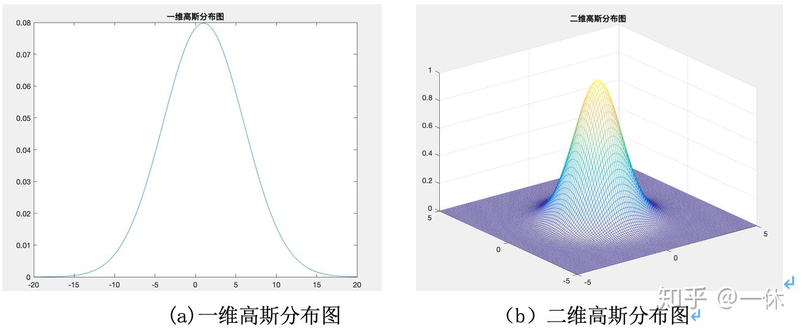

# 波

## 波的变换

### 常见函数

#### 三角函数

欧拉公式
$$
e^{ix}=\cos x + i\sin x
$$
三角函数的复数表示
$$
\sin z=\frac{e^{iz}-e^{-iz}}{2i}
$$

$$
\cos z=\frac{e^{iz}+e^{-iz}}{2}
$$

#### $\delta$函数

*德尔塔函数，冲击函数*

整体积分为1，除了0点以外，其他点函数值都为0
$$
\delta(x)=0,(x\ne0)
$$

$$
\int^{\infty}_{-\infty}\delta(x)dx=1
$$

#### 高斯函数

*概率论里的正态分布*
$$
f(x)=ae^{-(x-b)^2/2c^2}
$$

- a>0

#### 洛伦兹函数

*概率论里的柯西分布*
$$
f(x)=\frac{A}{B^2+x^2}
$$

#### 矩形脉冲函数

$$
f(t)=E[u(t+\frac{\tau}{2})-u(t-\frac{\tau}{2})]
$$

### 傅立叶变换

将一个满足条件的函数，转化为三角函数（或他们积分）的线性组合
$$
\hat{f}=<f,E_k>=\int f(x)e^{-2\pi i k\cdot x}\mathrm{d}x
$$
其傅里叶级数为
$$
\sum\hat{f}(k)E_k
$$

## 光是电磁波

### 光的基本性质

真空中光速为
$$
c=\frac{1}{\sqrt{\varepsilon_0 \mu_0}}=2.997 924 58 \times10^8 m/ s
$$

- 真空中电介质常量：$\varepsilon_0=8.85\times 10^{-12}F/m$
- 磁导率：$\mu_0=4\pi\times10^{-7}H/m$

光的能量
$$
E=hv=\frac{hc}{\lambda}
$$

- 普朗克常量：$h=6.626\times 10^{-34}J\cdot s$

光子数量，单位为photons

### 光子与电子的对比

|          | 电子  | 光子     |
| -------- | ----- | -------- |
| 静止质量 | $m_0$ | 0        |
| 运动质量 | $m$   | $hv/c^2$ |
| 运动速度 | $<c$  | $c$      |
| 自旋     | 1/2   | 1        |
| 分布规律 | 费米  | 玻色     |

### 电与磁

安培定则（右手螺旋定则）

法拉第电磁感应定律（右手定则）

#### 麦克斯韦方程组

法拉第
$$
\nabla \times \mathbf{E}=-\frac{\partial \mathbf{B}}{\partial t}
$$
安培
$$
\nabla \times \mathbf{B}=\mu_0 \varepsilon_0 \frac{\partial \mathbf{E}}{\partial t}
$$
高斯电场
$$
\nabla \times \mathbf{E}=0
$$
高斯磁场
$$
\nabla \times \mathbf{B}=0
$$

- Nabla算子：$\nabla=\frac{d}{dr}$

### 偏振

偏振：（横）波在垂直于传播方向的二维平面的振动

- 非偏振光
- 部分偏振光
- 完全偏振光
  - 线偏振光
  - 圆偏振光
  - 椭圆偏振光

#### 方向

我们以z轴正方向为光线前进的方向，于是偏振平面是在xy轴
$$
\mathbf{E}=E_x \hat{\mathbf{x}} + E_y \hat{\mathbf{y}}
$$

$$
E_x=E_{0x}\cos (kz-\omega t + \varphi_x)=E_{0x}\cos (\varphi)
$$

$$
E_y=E_{0y}\cos (kz-\omega t + \varphi_y)=E_{0y}\cos (\varphi + \delta)
$$

