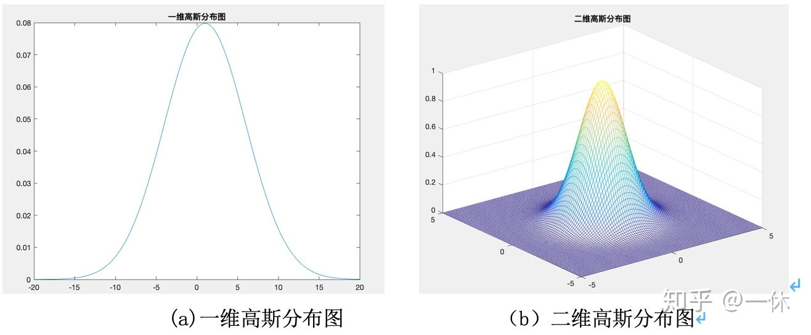

# 二：波动光学

## 内容概述

- 简谐波（simple harmonic waves）
- 傅里叶变换（Fourier Transform）
- 波的物理量

## 数学基础

### 常用函数

#### 三角函数

欧拉公式
$$
e^{\mathrm{i}x}=\cos x + \mathrm{i}\sin x
$$
三角函数的复数表示
$$
\sin z=\frac{e^{\mathrm{i}z}-e^{-\mathrm{i}z}}{2\mathrm{i}}
$$

$$
\cos z=\frac{e^{\mathrm{i}z}+e^{-\mathrm{i}z}}{2}
$$

#### $\delta$函数

*德尔塔函数，冲击函数*

整体积分为1，除了0点以外，其他点函数值都为0
$$
\delta(x)=0,(x\ne0)
$$

$$
\int^{\infty}_{-\infty}\delta(x)dx=1
$$

#### 高斯函数

*概率论里的正态分布*
$$
f(x)=ae^{-(x-b)^2/2c^2}
$$

- a>0

#### 洛伦兹函数

*概率论里的柯西分布*
$$
f(x)=\frac{A}{B^2+x^2}
$$

#### 矩形脉冲函数

$$
f(t)=E[u(t+\frac{\tau}{2})-u(t-\frac{\tau}{2})]
$$

## 波的数学表示

震荡（Vibration）：物理量围绕其平衡位置进行周期性变化

简谐震荡（Harmonic vibration）：物理量随着时间以三角函数的形式进行震荡
$$
U(t)=A\cos(\omega t+\varphi_0)
$$

- 振幅（amplitude，用$A$表示）
- 角频率（angular frequency，用$\omega$表示）

$$
\omega=\frac{2\pi}{T}
$$

- 相位（phase，用$\varphi$表示）
- 初相（initial phase，用$\varphi_0$表示）

波（waves）：震荡在空间中的传播

简谐波（simple harmonic waves）：进行简谐震荡的波

单色平面波可以视为简谐波

波阵面（wave surface）：波在介质中传播，经过相同时间所到达的各点所连成的线/面

波前（wave front）：最前面的波阵面

相速度（phase velocity，用$v_p$表示）：波传递的速度
$$
v_p=\frac{\omega}{k}
$$

## 傅立叶变换

将一个满足条件的函数，转化为三角函数（或他们积分）的线性组合
$$
\hat{f}=<f,E_k>=\int f(x)e^{-2\pi i k\cdot x}\mathrm{d}x
$$
其傅里叶级数为
$$
\sum\hat{f}(k)E_k
$$

