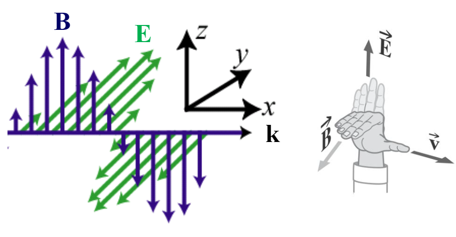
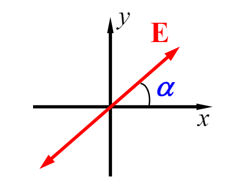
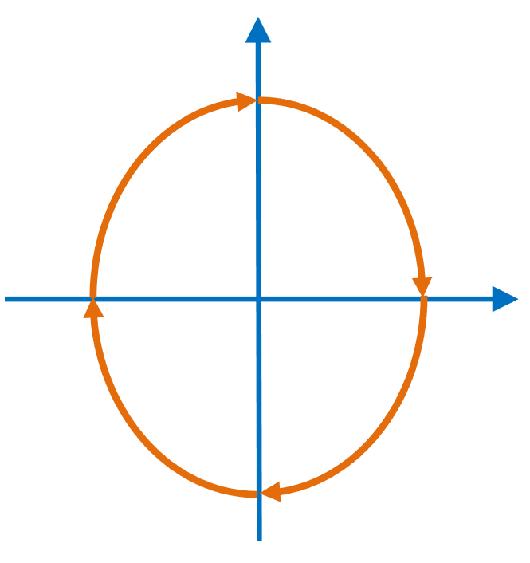
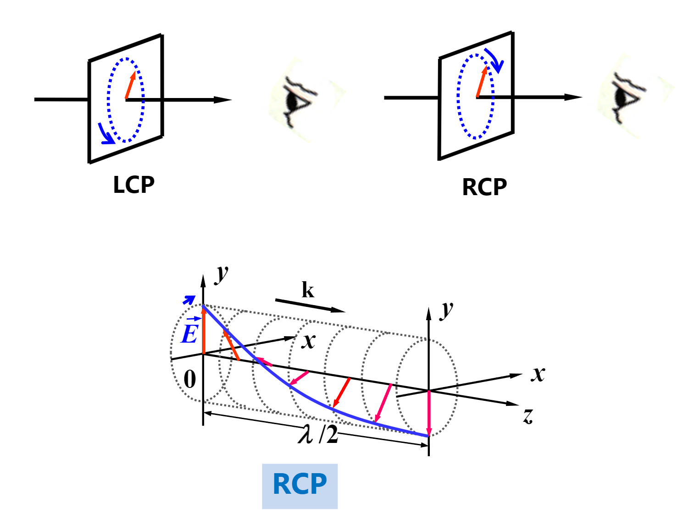
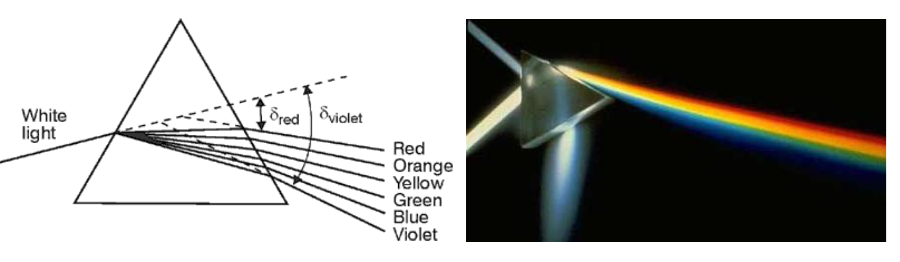
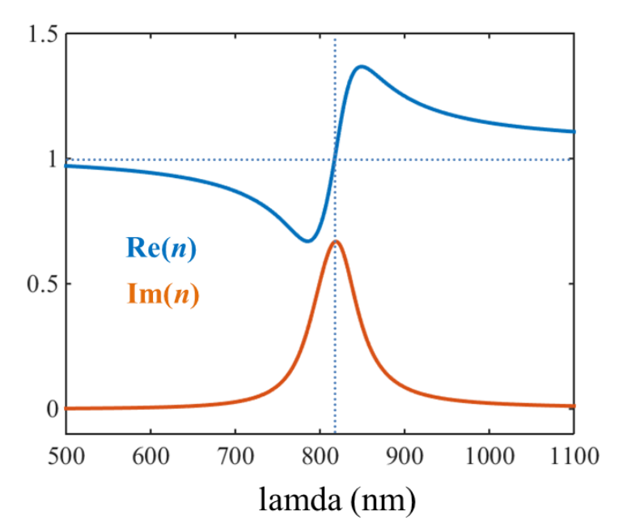

# 电磁波

## 内容概述

- 横波的性质（nature），强度（intensity），能量流动（energyflow）
- 偏振态（Polarization states），琼斯矩阵（Jones matrix/vector）
- 吸收（Absorption），色散（dispersion），折射率（refractive index）
- 微小粒子导致的散射（Scattering）

## 光的基本性质

- 光是电磁波
- 可见光的波长在400nm~760nm
- 人眼对550nm的黄绿光最敏感
- 单色光（Monochromatic light），指仅有一种波长的光，仅存在于理论中

### 光速

光在真空（vacuum）中的速度（简称光速，用c表示）为
$$
c=\frac{1}{\sqrt{\varepsilon_0 \mu_0}}=2.997 924 58 \times10^8 m/ s
$$
光在介质（medium）中的速度（也叫做相速度，用v表示）为
$$
v=\frac{1}{\sqrt{\varepsilon_0 \varepsilon_r\mu_0\mu_r}}=\frac{c}{\sqrt{\varepsilon_r \mu_r}}
$$
很显然光在介质中的速度比在真空中慢，我们用折射率（Refractive index，用n表示）来描述这一性质
$$
n=\frac{c}{v}
$$
光穿过线性介质（linear medium）时，其频率不会发生改变

光的波长（用$\lambda$表示）
$$
\lambda=\frac{c}{v}
$$

### 波粒二象性

#### 波

如果光是波，那么光应该有波的性质：
$$
\mathbf{k}=\frac{2\pi}{\lambda}\hat{\mathbf{k}}
$$

$$
v=\frac{\lambda}{T}=\lambda \nu
$$

$$
\omega=2\pi \nu =\frac{2\pi}{T}=\frac{2\pi}{\lambda}v=kv=k_0c
$$

- 波长（wavelength，用$\lambda$表示）
- 波向量（wave vector，用$\mathbf{k}$表示）
- 频率（frequency，用$\nu$表示）
- 周期（temporal period，用$T$表示）
- 角频率（angular frequency，用$\omega$表示）
- 速度（velocity，用$v$表示）

#### 粒

如果光是粒子，那么光应该有粒子的性质：
$$
E=h\nu=\hbar \omega
$$

$$
\mathbf{p}=\hbar \mathbf{k}=\frac{h}{\lambda}\hat{\mathbf{k}}
$$

- 能量（Energy，用$E$表示）
- 动量（Momentum，用$\mathbf{p}$表示）
- 普朗克常量（Plank constant，用$h$表示，$h=6.626\times 10^{-34}\mathrm{J}\cdot\mathrm{s}$
- 约化普朗克常量（用$\hbar$表示）

#### 波粒二象性

光具有波粒二象性（Wave-particle duality），光在传播过程中体现出明显的波性，在光与物质交互（light-matter interaction）中粒性更明显

#### 光子与电子

不同之处

|                             | 电子            | 光子          |
| --------------------------- | --------------- | ------------- |
| 静止质量（Rest mass）       | $m_0$           | 0             |
| 运动质量（Motion mass）     | $m$             | $hv/c^2$      |
| 运动速度（Motion velocity） | $<c$            | $c$           |
| 自旋（Spin）                | 1/2             | 1             |
| 分布定律                    | 费力（Fermion） | 玻色（Boson） |

相同之处

- 满足波粒二象性

#### 向量波与标量波

向量波（Vector wave），波函数是向量的波，比如电磁波（EM wave）

标量波（Scalar wave），波函数是标量的波，比如声波（Acoustic wave）

光波（Lightwaves）是一种向量波，但为了方便，我们在讨论干涉衍射时，会认为光是标量波，仅仅在讨论偏振时，才认为光是向量波

### 电磁波

#### 物理量

- 电场强度（用$\mathrm{E}$表示）：单位电荷在电场中受到的力
- 磁场强度（用$\mathrm{H}$表示）：通电导线周围有磁场，其强度与电流大小、距离远近有强度（但实际被后世推翻，无实际意义）
- 电场通量密度（用$\mathrm{D}$表示）：单位面积的电场通量
- 磁场通量/感应密度（用$\mathrm{B}$表示）：经过一个曲面的磁力线的数量

#### 电磁学三定律

库伦定律，真空中两个静止的点电荷间作用力满足
$$
F=k\frac{q_1q_2}{r^2}
$$

- 静电力常量（$k=9.0\times 10^9 \mathrm{N} \cdot\mathrm{m^2}/\mathrm{C^2}$）

安培环路定律（Ampère’s Circuital Law），也叫右手螺旋定则，载流导线能生磁

法拉第电磁感应定律（Faraday’s Induction Law），磁场变化能产生电场，感应电动势大小与磁通量变化率成正比，电场方向符合楞次定律（由于磁通量的改变而产生的感应电流，其方向为抗拒磁通量改变的方向）

#### 麦克斯韦方程

真空中麦克斯韦方程：

法拉第
$$
\nabla \times \mathbf{E}=-\frac{\partial \mathbf{B}}{\partial t}
$$

安培
$$
\nabla \times \mathbf{B}=\mu_0 \varepsilon_0 \frac{\partial \mathbf{E}}{\partial t}
$$

- 真空磁导率（也称为磁常数，用$\mu_0$表示，$\mu_0=4\pi \times 10^{-7}\mathrm{H}/\mathrm{m}$）
- 真空电容率（也称为电常数，用$\varepsilon_0$表示，$\varepsilon_0=8.854...\times10^{-12}\mathrm{F}/\mathrm{m}$）

高斯电场
$$
\nabla \cdot \mathbf{E}=0
$$

高斯磁场
$$
\nabla \cdot \mathbf{B}=0
$$

自由空间的波动方程（wave equations，由麦克斯韦方程推出）：
$$
\nabla^2\mathbf{E}=\mu_0 \varepsilon_0 \frac{\partial^2 \mathbf{E}}{\partial t^2}
$$

$$
\nabla^2\mathbf{B}=\mu_0 \varepsilon_0 \frac{\partial^2 \mathbf{B}}{\partial t^2}
$$

#### 平面波

三维的电磁波很难分析，我们可以分解变量，将其转化为两个垂直的平面波

平面波（Plane waves）：传播时波面在一个平面的电磁波

平面波的电场方向和磁场方向，与波矢方向垂直，如图，$\mathbf{k}$为波矢方向（推导过程略），从这里也能看出，平面波是横波，方向满足右手定则

平面波的磁感应强度B和电场强度E的比值等于波速
$$
\frac{|E|}{|B|}=\sqrt{\frac{1}{\mu \varepsilon}}=v
$$
电场强度和磁场强度的关系为（注意，这里不是磁感应强度）
$$
\sqrt{\varepsilon_0 \varepsilon_r}|\mathrm{E}|=\sqrt{\mu_0\mu_r}|\mathrm{H}|
$$
自由空间阻抗（单位和电阻相同，用$Z_0$表示）
$$
Z_0=\sqrt{\frac{\mu_0}{\varepsilon_0}}=376.73\Omega
$$
波能传递能量，我们引入坡印廷向量（Poynting vector，用$\mathrm{S}$来表示）来描述能量流动，其方向为电磁能传递方向，大小为能流密度（单位面积的能量传输速率）
$$
\mathrm{S}=\mathrm{E}\times \mathrm{H}
$$
平面波$\mathrm{E}\times \mathrm{H} // \mathrm{k}$

#### 辐照度

电磁波的辐照度（Irradiance，用$\mathrm{I}$表示，也称为Intensity），是坡印廷向量在时间上的平均值
$$
\mathrm{I}=\left< \mathrm{S} \right>=\frac{nc\varepsilon_0}{2}\mathrm{E_0}^2
$$

- $c$是真空中光速
- $\mathrm{E_0}$是电磁波电场强度的振幅（电场强度是一个三角周期函数）

从这里可以看出，辐照度与$\mathrm{E_0}$的平方成正比

## 偏振

偏振（Polarization）：光矢量在垂直于传播方向的平面上的震动状态，我们这里提的是电场强度$\mathrm{E}$的震动

- 根据是否发生偏振
  - 不偏振光（Unpolarizedlight）
  - 完全偏振光（Completely polarized light）
  - 部分偏振光（Partially polarized  light）

- 根据向量$\mathrm{E}$的终点（endpoint）轨迹
  - 线偏振（Linearly polarized light）
  - 圆偏振（Circularly polarized light）
  - 椭圆偏振（Elliptically polarized light）

若光线沿着z轴传播，其方程满足
$$
(\frac{E_x}{E_{0x}})^2+(\frac{E_y}{E_{0y}})^2-2(\frac{E_x}{E_{0x}})(\frac{E_y}{E_{0y}})\cos \delta = \sin ^2 \delta
$$
### 线偏振

当$\delta=2m\pi$时，方程变为
$$
(\frac{E_x}{E_{0x}})^2+(\frac{E_y}{E_{0y}})^2-2(\frac{E_x}{E_{0x}})(\frac{E_y}{E_{0y}}) = 0 \\
(\frac{E_x}{E_{0x}}-\frac{E_y}{E_{0y}})^2=0
$$
于是得到线偏振的方程（一三象限）
$$
\frac{E_x}{E_{0x}}=\frac{E_y}{E_{0y}} \equiv \cot \alpha
$$

同理，当$\delta=2(m+1)\pi$时，方程等于（二四象限）
$$
\frac{E_x}{E_{0x}}=-\frac{E_y}{E_{0y}}
$$
用虚数将两个方程合并，得到
$$
\frac{E_x}{E_{y}}=\frac{E_{0x}}{E_{0y}}e^{\mathrm{i}m'\pi}
$$

- 当$m'$为偶数（0 or even）时，一三象限
- 当$m'$为奇数（odd）时，二四象限

### 椭圆偏振与圆偏振

当$\delta=(2m+1)\frac{\pi}{2}$时，方程变为
$$
(\frac{E_x}{E_{0x}})^2+(\frac{E_y}{E_{0y}})^2=1
$$
这是一个椭圆方程，我们称之为椭圆偏振

倘若$E_{0x}=E_{0y}=E_{0}$，方程退化为
$$
E_x^2+E_y^2=E_0^2
$$
我们称之为圆偏振

- 当$\delta=\pi / 2$时，y轴驱动x轴移动，此时为顺时针，称为RCP

- 当$\delta=-\pi / 2$时，x轴驱动y轴移动，此时为逆时针，称为LCP

### 琼斯矢量

将偏振光的状态以向量的形式写出，方便运算（只适合完全极化光）
$$
\mathrm{E}=\left[
\begin{array}{c}
E_x(t)\\
E_y(t)\\
\end{array}
\right]
$$
琼斯向量左乘一个2x2矩阵，可以得到一个新的琼斯向量，这个矩阵被称为琼斯矩阵

### 偏振度

偏振度（Degree of polarization，用$P$表示）：用来衡量偏振程度的物理量
$$
P=\frac{I_p}{I_t}=\frac{I_p}{I_p+I_n}
$$

- $I_p$：完全偏振光部分的辐照度
- $I_n$：不偏振光部分（自然光）的辐照度

## 吸收

### 兰伯特定律

兰伯特定律（Lambert law）：光在气体介质中传播，光强（intensity）随着传播深度增加而递减，满足
$$
I=I_0 e^{-\alpha x}
$$

- 吸收系数（用$\alpha$表示）
- 传播深度（用$x$表示）

### 贝尔定律

贝尔定律（Beer law）：光在溶剂中传播，光强满足
$$
I=I_0 e^{-ACL}
$$

- 浓度（用$C$表示）
- 常数$A$，与溶质性质有关，与浓度无关

该公式满足有两个条件

- 溶液浓度不能过高，以免出现分子间作用力（这也能解释为什么常数$A$为什么和浓度无关，因为浓度一高，公式就不成立了）
- 光强不能过高

## 色散

色散（Dispersion）：光波的相速度随着频率的改变而改变的现象

正常色散（Normal dispersion）：折射率随着波长的增加而减小

柯西公式：
$$
n=A+B/\lambda^2+C/\lambda^4
$$
反常色散（Anomalous dispersion）：折射率随着波长的增加而增加

反常色散通常发生在吸收带（absorption band）附近，反常色散并不是异常的，叫这个名字只是历史问题

### 洛伦兹震荡模型

洛伦兹震荡模型（Lorentz oscillator model）：在一个尺寸为$\Delta V$的空间内有一个电子（电荷量为$1.6\times10^{-19}C$），在光的电场作用下，让该电子相对于稳定位置偏离x

偏振度（单位体积电偶极矩的振幅，用$P$表示）写作
$$
P=\frac{1}{\Delta V}ex=n_0ex
$$

- 电荷密度（density of charge，用$n_0$表示）
- $x$是电子的运动方程，如下

$$
x(\omega)=-\frac{eE(\omega)}{m_0}\frac{1}{\omega^2+\mathrm{i}\omega \gamma-\omega_0^2}
$$

将$x$带入，得到
$$
P=-\frac{n_0e^2}{m_0}\frac{1}{\omega^2+\mathrm{i}\omega \gamma-\omega_0^2}E(\omega)
\equiv \varepsilon_0 \chi(\omega)E(\omega)
$$
根据定义
$$
\varepsilon=\varepsilon_0[1+\chi(\omega)]
$$
带入得
$$
n^2=\varepsilon/\varepsilon_0=1-\frac{n_0e^2}{m_0}\frac{1}{\omega^2+\mathrm{i}\omega \gamma-\omega_0^2}
$$

如图，洛伦兹模型解释了为什么在靠近吸收带时，会发生反常色散

### 组速度

在介质中不同波长的光速度不同，红光波长大，跑的更快

那么如果一个光，包含了多种波长的光，我们用组速度（Group velocity，用$v_g$表示）来描述其速度
$$
v_g=\frac{\mathrm{d}\omega}{\mathrm{d}k}
$$

## 散射

### 瑞丽散射

瑞丽散射（Rayleigh scattering）：光在细小粒子间散射
$$
I_{scat}\propto 1/\lambda^4
$$

$$
I_{\theta}\propto I_{\pi/2}(1+\cos^2 \theta)
$$

### 米氏散射

米氏散射（Mie scattering）：光在大型粒子内部散射

